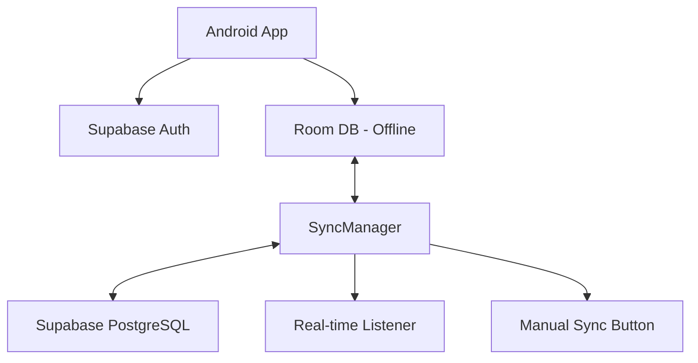
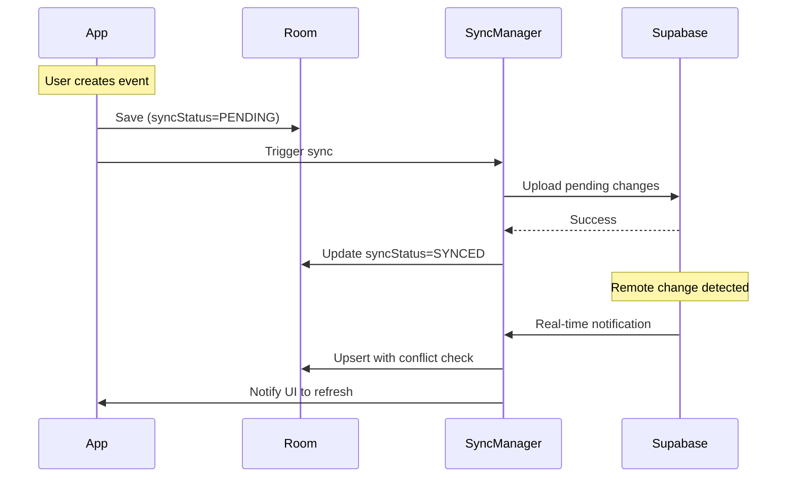

# User Authentication & Cloud Sync with Supabase

Add user authentication and cloud database sync using **Supabase** (PostgreSQL + Auth) with full offline support.

## Tech Stack

| Component | Technology |
|-----------|------------|
| **Auth** | Supabase Auth (Google, Apple, Email) |
| **Cloud DB** | Supabase PostgreSQL |
| **Local DB** | Room (SQLite) for offline |
| **Sync** | Real-time + Manual button |
| **Offline** | Full support with sync on reconnect |

---

## Architecture



---

## Proposed Changes

### Phase 1: Supabase Setup & Auth

#### [NEW] Dependencies (build.gradle.kts)
```kotlin
implementation("io.github.jan-tennert.supabase:gotrue-kt:2.0.0")
implementation("io.github.jan-tennert.supabase:postgrest-kt:2.0.0")
implementation("io.github.jan-tennert.supabase:realtime-kt:2.0.0")
implementation("io.ktor:ktor-client-android:2.3.7")
implementation("androidx.room:room-runtime:2.6.1")
kapt("androidx.room:room-compiler:2.6.1")
```

#### [NEW] [SupabaseClient.kt](file:///data/remote/SupabaseClient.kt)
- Initialize Supabase client with project URL and anon key

#### [NEW] [AuthRepository.kt](file:///data/repository/AuthRepository.kt)
- Sign in with Google/Apple/Email
- Session management and token refresh
- Sign out

#### [NEW] [LoginActivity.kt](file:///ui/auth/LoginActivity.kt)
- Login/Register screen
- Social sign-in buttons (Google, Apple)
- Email/password form

---

### Phase 2: Room Database (Offline Storage)

#### [NEW] [AppDatabase.kt](file:///data/local/AppDatabase.kt)
- Room database with Calendar and Event entities
- Add `syncStatus` enum: SYNCED, PENDING, CONFLICT

#### [NEW] [CalendarDao.kt](file:///data/local/CalendarDao.kt)
- CRUD operations with sync status tracking
- Query pending changes for upload

#### [UPDATE] [LocalCalendar.kt](file:///data/model/LocalCalendar.kt)
```kotlin
@Entity
data class LocalCalendar(
    @PrimaryKey val id: String,
    val userId: String,
    val name: String,
    val color: Int,
    val isDefault: Boolean,
    val isVisible: Boolean,
    val createdAt: Long,
    val updatedAt: Long,
    val syncStatus: SyncStatus = SyncStatus.PENDING
)
```

#### [UPDATE] [ICalEvent.kt](file:///data/model/ICalEvent.kt)
- Add `userId`, `createdAt`, `updatedAt`, `syncStatus` fields

---

### Phase 3: Supabase Sync

#### [NEW] [SupabaseRepository.kt](file:///data/repository/SupabaseRepository.kt)
- CRUD operations on Supabase tables
- Upsert with conflict resolution

#### [NEW] [SyncManager.kt](file:///data/sync/SyncManager.kt)
- Upload pending local changes
- Download remote changes
- Real-time subscription to changes
- Conflict resolution (last-write-wins using `updatedAt`)
- Network state monitoring for auto-reconnect

#### [UPDATE] [MainActivity.kt](file:///MainActivity.kt)
- Add manual sync button in drawer
- Show sync status indicator
- Check auth on launch

---

### Phase 4: PostgreSQL Schema

```sql
-- Users table (managed by Supabase Auth)

-- Calendars table
CREATE TABLE calendars (
    id UUID PRIMARY KEY DEFAULT gen_random_uuid(),
    user_id UUID REFERENCES auth.users(id) ON DELETE CASCADE,
    name TEXT NOT NULL,
    color INTEGER NOT NULL,
    is_default BOOLEAN DEFAULT false,
    created_at TIMESTAMPTZ DEFAULT now(),
    updated_at TIMESTAMPTZ DEFAULT now()
);

-- Events table
CREATE TABLE events (
    id UUID PRIMARY KEY DEFAULT gen_random_uuid(),
    user_id UUID REFERENCES auth.users(id) ON DELETE CASCADE,
    calendar_id UUID REFERENCES calendars(id) ON DELETE CASCADE,
    summary TEXT NOT NULL,
    description TEXT,
    location TEXT,
    dt_start BIGINT NOT NULL,
    dt_end BIGINT NOT NULL,
    all_day BOOLEAN DEFAULT false,
    rrule TEXT,
    exdate TEXT,
    color INTEGER,
    created_at TIMESTAMPTZ DEFAULT now(),
    updated_at TIMESTAMPTZ DEFAULT now()
);

-- Row Level Security (RLS)
ALTER TABLE calendars ENABLE ROW LEVEL SECURITY;
ALTER TABLE events ENABLE ROW LEVEL SECURITY;

CREATE POLICY "Users can only access their own calendars"
    ON calendars FOR ALL USING (auth.uid() = user_id);

CREATE POLICY "Users can only access their own events"
    ON events FOR ALL USING (auth.uid() = user_id);
```

---

## Sync Flow



---

## Verification Plan

### Manual Testing
1. Create Supabase account and project
2. Sign in with Google → verify user created
3. Create calendar/event → verify synced to Supabase
4. Airplane mode → create event → reconnect → verify sync
5. Install on 2nd device → sign in → verify data present
6. Manual sync button → verify all pending synced

---

## Implementation Phases

| Phase | Description | Effort |
|-------|-------------|--------|
| 1 | Supabase project + Auth UI | 2-3 hrs |
| 2 | Room database migration | 2 hrs |
| 3 | Supabase sync + real-time | 4 hrs |
| 4 | Offline queue + reconnect | 2 hrs |
| 5 | Manual sync + status UI | 1 hr |
| 6 | Testing | 2 hrs |

**Total Estimate: 13-14 hours**
